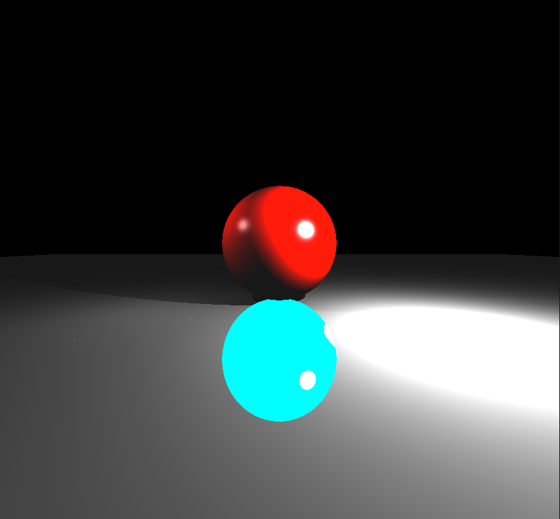

# CENG477 Testers

## HW1

The program iterates over the pixels and change the color of the pixels that are different in source image and target image.

```
python3 hw1_tester.py source_image target_image comparison_output epsilon color 
```

where   `source_image` is the sample scene, ( Example: `../sample_scenes/outputs/bfc_on/monkey.ppm`) <br />
        `target_image` is the result of your code, ( Example `outputs/monkey.ppm`) <br />
        `comparison_output` is the result image that has been colored by the `color` given by the user <br />
        `epsilon` is the acceptable int range for a pixel to be considered the same ( Exmaple: (255,255,255) == (255,254,254) ) <br />
        `color` is the color preferred by the user in order to change the color of different pixels in the source and target files <br />


Color Options = [white, yellow, cyan, green, magenta, red, blue, black] or specified by the user with three integer.

### Example Run

```
python3 tester.py test/simple_reflectance.ppm test/bfc_off_simple_reflectance.ppm comparison_image.ppm 5 cyan
```

### Example Output

